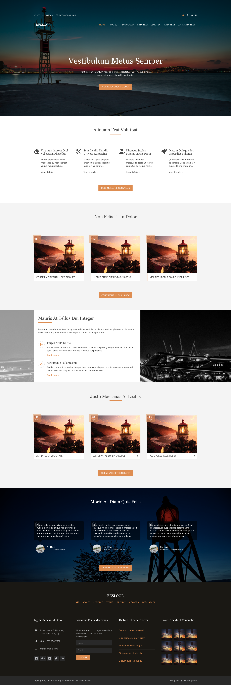

<h1 align="center">BESLOOR</h1>

 Site réalisé à partir d'une maquette png. Les images étaient fournies mais pas le Figma. Donc fait à l'oeil.  
Entrainement en responsive, en JS, en Grid, Flex... 
Le code n'est pas très propre car c'est un projet qui a un peu trainé.

